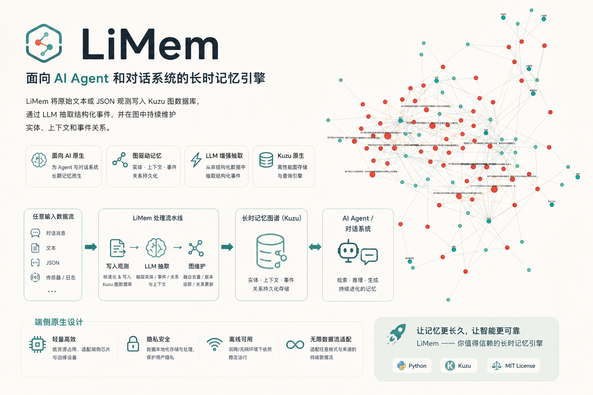

# LiMem



**让 Agent 在复杂端侧数据流中，精准召回当前情景真正相关的记忆。**

LiMem 是一个面向端侧环境设计的 Agent 长时记忆库。它可以接入任意输入数据流，包括对话文本、JSON、设备事件、传感器状态、工具调用记录和业务日志，并将这些观测转化为可持久化、可检索、可持续演化的记忆。

端侧 Agent 面对的不是干净的聊天记录，而是多源、碎片化、强上下文依赖的数据。LiMem 会把这些复杂输入沉淀为情景化记忆，并在后续对话、推理和工具调用中召回与当前场景最相关的部分。

## 已部署服务

> 线上实例已部署并开放控制台入口。访问前需要有效的 LiMem API Key。

<table>
  <tr>
    <td width="50%">
      <h3>LiMem 控制台</h3>
      <p>普通用户可管理自己的数据库、写入/检索记忆和自助管理 API Key；管理员可创建用户、签发 Key、查看全局状态。</p>
      <p>
        <a href="https://limem.gaooooosh.art/ui/login"><strong>打开控制台 -></strong></a>
      </p>
    </td>
    <td width="50%">
      <h3>API 服务</h3>
      <p>所有 API 都通过同一域名访问，使用 <code>X-API-Key</code> 或 <code>Authorization: Bearer ...</code> 鉴权。</p>
      <p>
        <a href="https://limem.gaooooosh.art"><strong>https://limem.gaooooosh.art</strong></a>
      </p>
    </td>
  </tr>
</table>

快速验证：

```bash
export BASE=https://limem.gaooooosh.art
export USER_KEY=your-user-api-key

curl -sS "$BASE/me" -H "X-API-Key: $USER_KEY"
curl -sS "$BASE/databases" -H "X-API-Key: $USER_KEY"
```

## 可以做什么

- **把任意输入变成记忆**：对话、JSON、日志、设备事件都可以直接写入。
- **理解复杂端侧场景**：融合用户指令、设备状态、环境变化和历史行为。
- **情景相关召回**：不是简单关键词匹配，而是按当前上下文找到真正有用的记忆。
- **让记忆可追踪**：保留事件、实体、上下文和关系，不只是存一段文本。
- **让 Agent 能召回过去**：根据问题检索相关历史，辅助后续对话和决策。
- **适合端侧部署**：本地 Kuzu 持久化，支持弱网、隐私敏感和边缘设备场景。
- **自带可视化**：通过图谱页面查看记忆如何形成、连接和演化。

## 适用场景

- 个人 AI 助手：长期记住用户偏好、习惯和历史请求。
- 车载/IoT Agent：融合对话、设备状态、传感器和业务事件。
- 客服/运营助手：跨会话保留用户背景、问题进展和处理记录。
- 本地优先应用：在隐私敏感或弱网环境中运行记忆系统。

## 快速开始

要求：

- Python 3.12+
- `uv`
- Docker / Docker Compose（服务部署）
- Node.js 20+（仅本地开发或单独构建前端时需要；Docker 会自动构建前端）
- DashScope API Key，或兼容 OpenAI SDK 的模型服务

安装依赖：

```bash
git clone https://github.com/gaooooosh/LiMem.git
cd LiMem
uv sync
cp .env.example .env
```

在 `.env` 中配置：

```bash
DASHSCOPE_API_KEY=your_api_key
ROOT_API_KEY=change-me-to-a-long-random-token
```

Python 使用示例：

```python
import time
from limem import create_ltm

ltm = create_ltm(db_path="./DB/demo_db.kz")

result = ltm.ingest_text(
    "用户说：导航去公司，车机回答：已开始导航。",
    timestamp=int(time.time()),
)

print(result.to_dict())
print(ltm.retrieve_memories("用户最近导航去了哪里？", top_k=5))
```

运行脚本时设置 `PYTHONPATH`：

```bash
PYTHONPATH=src uv run python your_script.py
```

## HTTP API（多租户服务）

启动服务：

```bash
ROOT_API_KEY=change-me-to-a-long-random-token \
PYTHONPATH=src uv run python -m service.main
```

所有服务接口都使用 API Key 鉴权。推荐使用 `X-API-Key` 请求头，也支持
`Authorization: Bearer ...`。

```bash
export BASE=http://127.0.0.1:8000
export ROOT_KEY=change-me-to-a-long-random-token
```

### 管理员初始化用户

ROOT key 只适合初始化和应急管理。生产环境建议创建具名 admin/user key 后使用。

创建用户：

```bash
curl -sS -X POST "$BASE/admin/users" \
  -H "X-API-Key: $ROOT_KEY" \
  -H "Content-Type: application/json" \
  -d '{"name":"alice"}'
```

给用户签发 API Key：

```bash
curl -sS -X POST "$BASE/admin/users/{user_id}/keys" \
  -H "X-API-Key: $ROOT_KEY" \
  -H "Content-Type: application/json" \
  -d '{"label":"laptop","scopes":"r,w"}'
```

scope 说明：

- `r`：读取自己的库、查询、健康检查、统计和审计日志。
- `w`：创建/归档自己的库、写入记忆、演化、重建索引；`w` 同时可读。
- `admin`：访问 `/admin/*`。谨慎签发。

### 普通用户操作流程

普通用户拿到 API Key 后，可以完成以下自助操作：

```bash
export USER_KEY=your-user-api-key
```

查看当前身份：

```bash
curl -sS "$BASE/me" -H "X-API-Key: $USER_KEY"
```

查看自己的 Key：

```bash
curl -sS "$BASE/me/keys" -H "X-API-Key: $USER_KEY"
```

自助签发权限不超过自己的子 Key：

```bash
curl -sS -X POST "$BASE/me/keys" \
  -H "X-API-Key: $USER_KEY" \
  -H "Content-Type: application/json" \
  -d '{"label":"readonly-dashboard","scopes":"r"}'
```

撤销自己的 Key：

```bash
curl -sS -X DELETE "$BASE/me/keys/{key_id}" \
  -H "X-API-Key: $USER_KEY"
```

创建自己的数据库：

```bash
curl -sS -X POST "$BASE/databases" \
  -H "X-API-Key: $USER_KEY" \
  -H "Content-Type: application/json" \
  -d '{"display_name":"my-memory"}'
```

列出自己的活跃数据库：

```bash
curl -sS "$BASE/databases" -H "X-API-Key: $USER_KEY"
```

写入记忆：

```bash
curl -sS -X POST "$BASE/db/{db_id}/ingest" \
  -H "X-API-Key: $USER_KEY" \
  -H 'Content-Type: application/json' \
  -d '{
    "data": {
      "source": "device_event_stream",
      "payload": {
        "user_intent": "drive_to_office",
        "screen": "navigation"
      }
    }
  }'
```

检索记忆：

```bash
curl -sS -X POST "$BASE/db/{db_id}/query" \
  -H "X-API-Key: $USER_KEY" \
  -H 'Content-Type: application/json' \
  -d '{"query":"用户最近导航去了哪里","top_k":5}'
```

查看库健康、统计和审计：

```bash
curl -sS "$BASE/db/{db_id}/health" -H "X-API-Key: $USER_KEY"
curl -sS "$BASE/db/{db_id}/stats" -H "X-API-Key: $USER_KEY"
curl -sS "$BASE/db/{db_id}/api/audit/recent?limit=20" -H "X-API-Key: $USER_KEY"
```

触发演化或重建 BM25 索引（需要 `w` scope）：

```bash
curl -sS -X POST "$BASE/db/{db_id}/evolve" -H "X-API-Key: $USER_KEY"
curl -sS -X POST "$BASE/db/{db_id}/rebuild-index" -H "X-API-Key: $USER_KEY"
```

归档自己的数据库：

```bash
curl -sS -X DELETE "$BASE/databases/{db_id}" -H "X-API-Key: $USER_KEY"
```

常用入口：

- `GET /me`
- `GET/POST /me/keys`
- `GET/POST/DELETE /databases`
- `POST /db/{db_id}/ingest`
- `POST /db/{db_id}/query`
- `GET /db/{db_id}/health`
- `GET /db/{db_id}/stats`
- `GET /db/{db_id}/api/audit/recent`
- `GET /graph?db={db_id}&key={api_key}`
- `GET /logs?db={db_id}&key={api_key}`
- `GET /ui/login`

完整接口见 [docs/http-api.md](docs/http-api.md)。

## Web 控制台

服务内置 React 控制台。构建 Docker 镜像时，前端会自动打包并复制到
FastAPI 静态目录。

本地 Docker 默认访问：

- 控制台：`http://127.0.0.1:8012/ui/login`
- API：`http://127.0.0.1:8012`

如果用域名反向代理到 `127.0.0.1:8012`，直接访问：

```text
https://your-domain.example/ui/login
```

用户在登录页输入自己的 API Key 后：

- 普通 `r,w` 用户进入“我的库”，可管理自己的数据库、写入和检索记忆。
- `admin` 用户进入“管理后台”，可创建用户、签发 Key、查看全局数据库。
- ROOT key 可登录，但建议只用于初始化和应急操作。

本地前端开发：

```bash
cd web
npm install
npm run dev
```

Vite dev server 默认运行在 `http://127.0.0.1:5173`，并把 API 请求代理到
`http://127.0.0.1:8000`。

## Docker 部署

```bash
docker compose up -d --build
```

默认访问：

- 控制台：`http://127.0.0.1:8012/ui/login`
- API：`http://127.0.0.1:8012`
- 图谱可视化：`http://127.0.0.1:8012/graph?db={db_id}&key={api_key}`
- 审计日志：`http://127.0.0.1:8012/logs?db={db_id}&key={api_key}`

默认持久化目录：

- `./DB`: 鉴权 SQLite 与每个用户的 Kuzu 数据库
- `./outputs`: 审计日志和导出结果

Compose 默认只监听本机：

```yaml
ports:
  - "127.0.0.1:8012:8000"
```

生产环境可以用 Caddy / Nginx / Cloudflare Tunnel 等反向代理把域名转发到
`127.0.0.1:8012`。反向代理只需要转发 HTTP 请求；鉴权由 LiMem API 自己完成。

## 文档

- [Architecture](docs/architecture.md)
- [HTTP API](docs/http-api.md)
- [Development](docs/development.md)

## License

No license file is currently included. Add a `LICENSE` file before publishing this as an open-source project.
